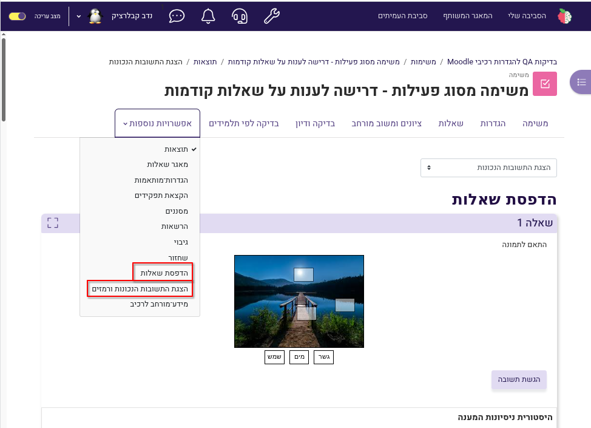
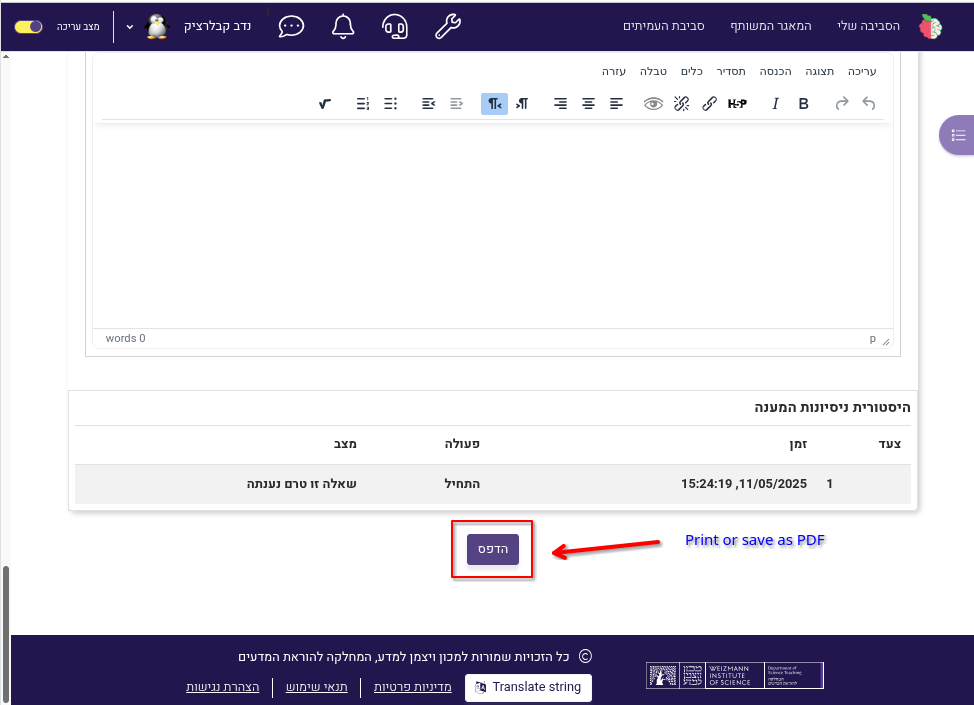

# moodle-quiz_correctanswer
Moodle quiz report to display questions for offline printing and with a display hints mode

# Moodle Quiz Report Plugin

A custom Moodle plugin that extends quiz reporting capabilities, providing quiz question pring for offline use by educators and students.

## Features

- Visual representations of quiz question
- Enable displaying of correct answers, and also hints
- PDF print options for further analysis
- Full RTL (Right-to-Left) language support

## Requirements

- Moodle version 4.0 or higher
- PHP 7.4 or higher
- MySQL 5.7+ or MariaDB 10.2+
- JavaScript enabled in the browser

## Installation

1. Download the plugin from GitHub or the Moodle plugins directory.
2. Extract the contents to the `mod/quiz/report/correctanswer` directory of your Moodle installation.
3. Visit the Moodle site administration area to complete the installation process.
4. Navigate to Site administration > Plugins > Reports > Manage reports to configure the plugin.

Alternatively, you can install via Git:

```bash
cd /path/to/moodle/mod/quiz/report/
git clone https://github.com/PeTeL-Weizmann/moodle-quiz_correctanswer.git correctanswer
```

## Usage

To access the reports:

1. Navigate to any quiz in your course.
2. Click on "More" menu.
3. Select "Print quiz" from the report type dropdown.
4. Or, select "Print quiz correct answers with hints" from the report type dropdown.
5. Configure the report parameters as needed.
6. View the generated report and use the "PRINT" button at the bottom of the report to print it or save it as PDF.

## Screenshots

View report


Print report


## Development

### Contributing

Contributions are welcome! Please follow these steps:

1. Fork the repository
2. Create a feature branch (`git checkout -b feature/amazing-feature`)
3. Commit your changes (`git commit -m 'Add some amazing feature'`)
4. Push to the branch (`git push origin feature/amazing-feature`)
5. Open a Pull Request

Please ensure your code follows the [Moodle coding guidelines](https://docs.moodle.org/dev/Coding_style).

### RTL support

This plugin fully supports Right-to-Left (RTL) languages such as Arabic, Hebrew, Persian, and Urdu. Key RTL features include:

- Automatic text direction switching based on language settings
- Properly aligned UI elements for RTL languages
- Correct chart and graph orientation in RTL mode
- RTL-compatible export documents
- Bidirectional text support for mixed language content
- Tested with popular RTL languages used in educational settings

To enable RTL support:

1. Ensure your Moodle language pack for RTL languages is installed
2. Set your preferred language in your user profile
3. The plugin will automatically adjust its interface based on language direction

### Testing

Before submitting your changes, please test them thoroughly:

1. Run the Moodle code checker and PHPUnit tests
2. Test on both clean installations and upgraded sites
3. Verify compatibility with different Moodle versions (where applicable)

## Privacy

This plugin complies with the EU General Data Protection Regulation (GDPR). See the [Privacy API documentation](https://docs.moodle.org/dev/Privacy_API) for details on how user data is handled.

## License

This plugin is licensed under the [GNU GPL v3 or later](https://www.gnu.org/licenses/gpl-3.0.html).
Was designed and funded by the [Department of science teaching](https://www.weizmann.ac.il/ScienceTeaching/) at the [Weizmann institute of science](https://www.weizmann.ac.il/), israel. 
And developed for the [PeTeL](https://stwww1.weizmann.ac.il/petel/) - personalized teaching and learning envirunment ( EN ) project by [DevLion](https://devlion.co.il/).

## Credits

- Moodle System architect - Nadav Kavalerchik <nadav.kavalerchik@weizmann.ac.il>
- Lead Developer: Oleg Ochkurenko <oleg@devlion.co>
- Contributors: Oshrat Luski <oshrat.luski@weizmann.ac.il>, Vlad <vlad@devlion.co>

## Support

For support, please:

1. Check the [GitHub Issues](https://github.com/PeTeL-Weizmann/moodle-quiz_correctanswer/issues) for existing problems and solutions
2. Create a new GitHub issue if you've found a bug

## Changelog

### v1.0.0 (2020-06-30)
- Initial release

### v1.1.0 (2024-12-12)
- Added Hints
- Added support to Math formulas

---

*This plugin was developed independently and is not affiliated with or endorsed by Moodle HQ.*
